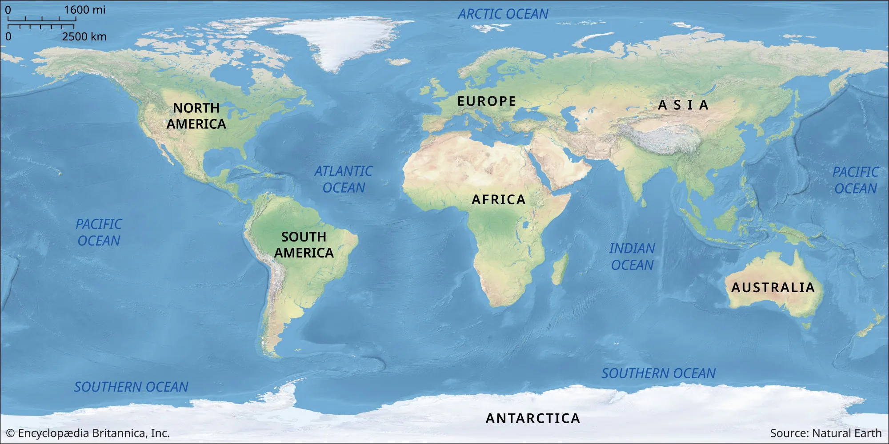

# Gapminder Data Explorer

[Link to Assignment B3](https://yrc10.shinyapps.io/shinyappb3/)

[Link to Assignment B4](https://yrc10.shinyapps.io/shinyapp4/)

Ruichen Yao

84951482

last update: 2023-12-07



## Application Description

This application uses the gapminder database to display Life Expectancy, Total Population, and Per-Capita GDP data for each continent of the world. Users can freely select time intervals, continents, countries/regions, and characteristics. The application will display the average value of the selected continent and the individual value of the selected country/region on the chart in real time. In addition, there is a corresponding more detailed table below the chart for viewing.

## Features

### Assignment B3
1. World map image

2. Selection bar that can select the range of year, from 1952 to 2007

3. Selection menu of the continent. It also contains a 'World' option that represents the selected property of the whole world

4. Selection menu of property. It contains 3 properties: Life Expectancy, Total Population, and Per-Capita GDP

5. Line chart and table of selected properties

### Assignment 4

1. Selection menu of country/region. It contains all countries/regions in the selected continent

2. The Line chart can display both the average value of the selected continent and the individual value of the selected country/region

3. Map image changes based on selected continent

## Reminder
If you want to update any files, always pull from the master branch first!
```
git pull origin main
```
